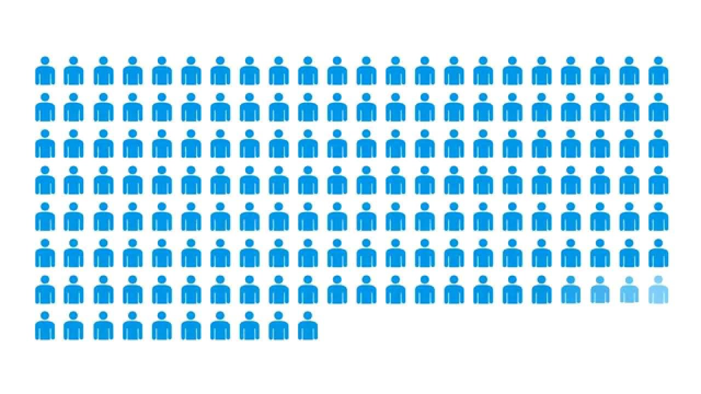

# Customer_Analytics_Telecom_Project

# Background:
- The background of this Dataset is to analyzing telecom customer churn data is crucial for providers to understand factors influencing customer departure. 
- This data helps identify patterns in service quality, pricing, and customer satisfaction, allowing companies to proactively address issues, improve customer retention strategies, and enhance overall service delivery. 
- Data analysis in this context enables telecom companies to stay competitive by adapting to evolving customer preferences and mitigating potential churn risks.

# The objective are the following:
1. To analyze "Customer Churn" and understand the factors associated with it by addressing some arising questions.
2. Develop Churn Prediction Model 
3. Implement Machine Learning Algorithms and select the best method for Churn Prediction

# Outcomes:
- Insights from the data and project are presented through a set of slides to help drive business decisions.

# Data Scientific methods explored and performed:
## Data Management:
  - Overview of Dataset:
     - Data source: Customer_Analytics_Telecom_Master.xlsx
  - Key variables:
    - Tenure, SeniorCitizen, Partner, Dependents, etc.
  
  - Initial Data Cleaning and Preparation:
    - Handling missing values,
    - Data type conversion

  
## Exploratory Data Analysis:
  - A number of variables influencing Churn was identified and extracted from my findings and visualized further into Bar bar charts and histogram to help understand. 

## Model Development
  - ML Models Used:
    - Logistic Regression
    - Decision Tree (DT)
    - Naïve Bayes
    - Random Forest

  - Feature Selection and Engineering:
    - Conversion of categorical variables to factors
    - Splitting data into training and test sets

## Model Evaluation
   - Metrics for Evaluation:
     - Accuracy
     - Precision
     - Recall
     - F1 Scoring
   - Comparison of Model Performance:
     - A confusion Matrix for each model

## Best Model Selection
  - Summary of model performances using resamples
  - Confusion Matrix and ROC Curve

### For a more detailed information on the above methods employed, the presentation slides can be found when you click ['here'](https://github.com/robert-solomon12/Customer_Analytics_Telecom_Project/blob/main/Telekom_Analytics_Pre.pdf)
